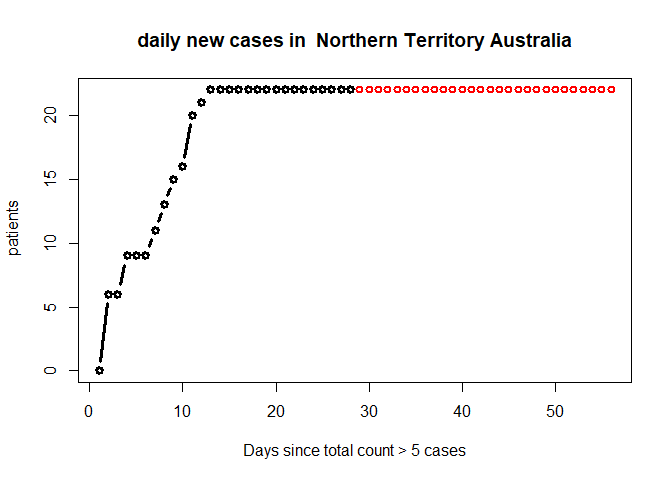

# covid19forec

covid19 forecasting


Covid19 Forecasting with Global Linear Models
================
Pablo Montero-Manso

``` r
library(covid19forec)
library(dplyr)
library(tidyr)
library(readr)
library(lubridate)
library(downloader)
```

Load the data from the web, as it was in 21 April 2020 and add some
benchmark forecasts on a temporal holdout.

``` r
data("covid_global")


cases_list = curated_cases_list(covid_global)

#remove very short time series
cases_list = Filter(function(ll) length(ll$x) > 15 , cases_list)

#differenciate to use new daily cases
cases_list = lapply(cases_list, function(ll) {
  ll$x = diff(ll$x)
  ll
})
cases_list = Filter(function(ll) sum(ll$x < 0) < 1, cases_list)

#calculate forecasts of base models for comparison purposes
cases_list = prepare_forecasts(cases_list, horiz = 7)

#set negative forecasts to 0
cases_list = lapply(cases_list, function(ll) {
  ll$ff[ll$ff < 0] = 0
  ll
})
```

Try the global models, train on all the data but do model selection
based only on the series that will actually be forecasted.

``` r
do_MASE = FALSE
do_log = TRUE
do_maxnorm = FALSE
do_inverse_trans = FALSE


res = analyze_glob_model(cases_list, linear_model,  MASE_norm = do_MASE,
                         ret_series = TRUE, do_log_transform = do_log,
                         do_max_scale = do_maxnorm, 
                         do_inversion = do_inverse_trans)
#> applying MASE normalization: FALSE
#> applying sample weighting: FALSE


focus_series = attr(res, "forec_series")
focus_series = Filter(function (ll) grepl("Australia", ll$id),
                                        focus_series)

#show the  MASE, SMAPE and MAE of the errors in Australia
res = calc_error_summary(focus_series)
res
#>            arima_forec ets_forec theta_forec custom_AR1 custom_AR2 custom_AR3
#> mnse_1          0.6768    0.6610      0.6951     0.6496     0.7299     0.5148
#> smape         123.8431  155.8638    136.0107   131.9396   130.8406   130.6353
#> errcscl_ 1      6.9620    6.5539      7.5313     5.8366     6.4770     5.1795
#>            custom_AR4 custom_AR5 custom_AR6 custom_AR7 custom_AR8 custom_AR9
#> mnse_1         0.4976     0.5103     0.5086     0.5071     0.4978     0.4871
#> smape        131.3093   131.0784   130.9136   130.7142   130.9242   160.0122
#> errcscl_ 1     5.1881     5.3061     5.2986     5.2954     5.1431     4.8582
#>            custom_AR10 custom_AR11
#> mnse_1          0.4643      0.4488
#> smape         158.9044    159.5762
#> errcscl_ 1      4.5251      4.3014

#normalize the errors by the best 10 average to get a relative sense of accuracy
rel_smape = as.numeric(res[2,])
rel_smape = rel_smape / mean(sort(rel_smape)[1:10])
rel_abs =  as.numeric(res[3,])
rel_abs = rel_abs / mean(sort(rel_abs)[1:10])
rel_mase =  as.numeric(res[1,])
rel_mase = rel_mase / mean(sort(rel_mase)[1:10])

#average over the three errors
rel_errors = round(rel_mase + rel_smape + rel_abs,2)
rel_errors
#>  [1] 3.64 3.78 3.89 3.43 3.71 3.03 3.00 3.05 3.04 3.04 2.99 3.13 3.02 2.95

which.min(rel_errors)
#> [1] 14
best_method = which.min(tail(rel_errors,-3))


message(paste("Best found method:",  tail(names(res),-3)[best_method]))
#> Best found method: custom_AR11
```

Create the forecasts, train on the full dataset but focus on the

``` r


horiz = 28
cases_toff = lapply(cases_list, function(ll) {
  ll$x = ts(c(ll$x, ll$xx))
  ll$xx = ts(rep(0, horiz))
  ll$ff = NULL
  ll
})


res = analyze_glob_model(cases_toff, linear_model, MASE_norm = do_MASE,
                         ret_series = TRUE, do_log_transform = do_log,
                         lag_range = 1:best_method,
                         do_max_scale = do_maxnorm)
#> applying MASE normalization: FALSE
#> applying sample weighting: FALSE
#> Setting Custom Lag Range


focus_series = attr(res, "forec_series")
focus_series = Filter(function (ll) grepl("Australia", ll$id),
                                        focus_series)


#example plot
rs =  sample(1:length(focus_series),1)
for (rs in 1:length(focus_series)) {
plot( cumsum(c(focus_series[[rs]]$x, focus_series[[rs]]$ff[best_method,])),type="b", col="red", lwd=2,
      main = paste("daily new cases in ", focus_series[[rs]]$id),
      ylab = " patients", xlab="Days since total count > 5 cases")
lines( cumsum(c(focus_series[[rs]]$x)),type="b", lwd=3)
}
```

<!-- --><!-- --><!-- --><!-- --><!-- --><!-- --><!-- -->

``` r

#the coefficients of the model
attr(res, "last_model")$coef
#>              [,1]
#>  [1,]  0.15953962
#>  [2,]  0.27728489
#>  [3,]  0.25190022
#>  [4,]  0.15492071
#>  [5,]  0.13857161
#>  [6,]  0.10486980
#>  [7,]  0.10848725
#>  [8,]  0.01918498
#>  [9,] -0.05668675
#> [10,] -0.07413283
#> [11,] -0.08851835
```
